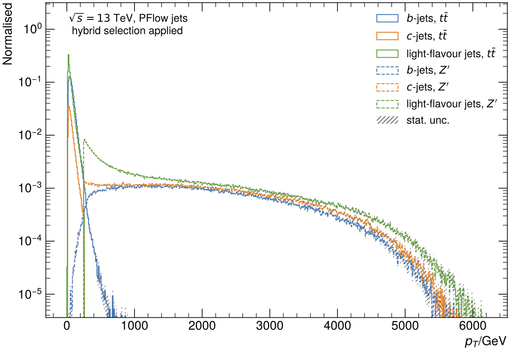
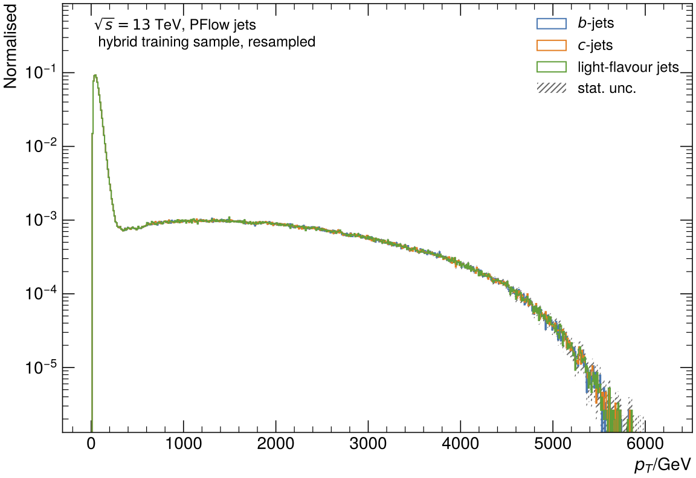

## Introduction
For the training of umami, the ntuples can be used which are specified in the section [MC Samples](mc-samples.md).

Training ntuples are produced using the [training-dataset-dumper](https://gitlab.cern.ch/atlas-flavor-tagging-tools/training-dataset-dumper) which dumps them directly into hdf5 files. The finished ntuples are also listed in the table in the file [MC-Samples.md](mc-samples.md). However, the training ntuples are not yet optimal for training the different b-taggers and require preprocessing.

### Preprocessing
The motivation for preprocessing the training samples results from the fact that the input datasets are highly imbalanced in their flavour composition. While there are large quantities of light jets, the fraction of b-jets is small and the fraction of other flavours is even smaller.
A widely adopted technique for dealing with highly unbalanced datasets is called resampling. It consists of removing samples from the majority class (under-sampling) and / or adding more examples from the minority class (over-sampling).
In under-sampling, the simplest technique involves removing random records from the majority class, which can cause loss of information.
Another approach can be to tell the network how important samples from each class are. For e.g. a majority class you can reduce the impact of samples from this class to the training. You can do this by assigning a weight to each sample and use it to weight the loss function used in the training.

### Hybrid samples
Umami/DIPS and DL1r are trained on so-called hybrid samples which are created using both ttbar and Z' input jets.
The hybrid samples for PFlow jets are created by combining events from ttbar and Z' samples based on a pt threshold, which is defined by the `pt_btagJes` variable for all jet-flavours.
Below a certain pt threshold (which needs to be defined for the preprocessing), ttbar events are used in the hybrid sample. Above this pt threshold, the jets are taken from Z' events.
The advantage of these hybrid samples is the availability of sufficient jets with high pt, as the ttbar samples typically have lower-pt jets than those jets from the Z' sample.



The production of the hybrid samples in the preprocessing stage requires preparation of input files which are created from the training ntuples.

Additional preprocessing steps for PFlow jets are required to ensure similar kinematic distributions for the jets of different flavours in the training samples in order to avoid kinematic biases. One of these techniques is downsampling which is used in the `Undersampling` approach.



Finally, the input features are scaled and shifted to normalise the range of the independent variables.
[Wikipedia](https://en.wikipedia.org/wiki/Feature_scaling) gives a motivation for the scaling + shifting step:

> Since the range of values of raw data varies widely, in some machine learning algorithms, objective functions will not work properly without normalization. For example, many classifiers calculate the distance between two points by the Euclidean distance. If one of the features has a broad range of values, the distance will be governed by this particular feature. Therefore, the range of all features should be normalized so that each feature contributes approximately proportionately to the final distance. Another reason why feature scaling is applied is that gradient descent converges much faster with feature scaling than without it.

All these steps are implemented in the `preprocessing.py` script, whose usage is described below in the documentation.

### Jet truth labelling
The standard labelling is provided via the `HadronConeExclTruthLabelID` variable while an extended jet labelling is available via the `HadronConeExclExtendedTruthLabelID` variable.
For more information, consider the [FTAG TWiki about flavour labelling](https://twiki.cern.ch/twiki/bin/view/AtlasProtected/FlavourTaggingLabeling).

| HadronConeExclTruthLabelID | Category         |
| -------------------------- | ---------------- |
| 0                          | light jets       |
| 4                          | c-jets           |
| 5                          | b-jets    |
| 15                         | tau-jets         |

| HadronConeExclExtendedTruthLabelID | Category         |
| ---------------------------------- | ---------------- |
| 0                                  | light jets       |
| 4                                  | c-jets           |
| 5, 54                              | single b-jets    |
| 15                                 | tau-jets         |
| 44                                 | double c-jets    |
| 55                                 | double b-jets    |

For the `HadronConeExclTruthLabelID` labelling, the categories `4` and `44` as well as `5`, `54` and `55` are combined.


## Ntuple preparation
The jets used for the training and validation of the taggers are taken from ttbar and Z' events. Different flavours can be used and combined to prepare different datasets for training/evaluation. The standard classes used are `bjets`, `cjets` and `ujets` (light jets).
After the ntuple production (training-dataset-dumper) the samples have to be further processed using the Umami [`preprocessing.py`](https://gitlab.cern.ch/atlas-flavor-tagging-tools/algorithms/umami/-/blob/master/umami/preprocessing.py) script. The preprocessing script is configured using a dedicated configuration file.
See [`examples/PFlow-Preprocessing.yaml`](https://gitlab.cern.ch/atlas-flavor-tagging-tools/algorithms/umami/-/blob/master/examples/PFlow-Preprocessing.yaml) for an example of a preprocessing config file.


### Configuration files
Note that this file is formatted according to [`yaml`](https://en.wikipedia.org/wiki/YAML) specifications, so keeping an eye on the indentation is very important. An explanation of the features of this file is given in the example below:

#### Parameters
```yaml
parameters: !include Preprocessing-parameters.yaml
```

This line specifies where the ntuples (which are used) are stored and where to save the output of the preprocessing. You can find the file [here](https://gitlab.cern.ch/atlas-flavor-tagging-tools/algorithms/umami/-/blob/master/examples/Preprocessing-settings-Freiburg.yaml).

#### Cut Templates
```yaml
# Defining anchor with outlier cuts that are used over and over again
.outlier_cuts: &outlier_cuts
  - JetFitterSecondaryVertex_mass:
      operator: <
      condition: 25000
      NaNcheck: True
  - JetFitterSecondaryVertex_energy:
      operator: <
      condition: 1e8
      NaNcheck: True
  - JetFitter_deltaR:
      operator: <
      condition: 0.6
      NaNcheck: True
  - softMuon_pt:
      operator: <
      condition: 0.5e9
      NaNcheck: True
  - softMuon_momentumBalanceSignificance:
      operator: <
      condition: 50
      NaNcheck: True
  - softMuon_scatteringNeighbourSignificance:
      operator: <
      condition: 600
      NaNcheck: True

# Defining yaml anchors to be used later, avoiding duplication
.cuts_template_ttbar_train: &cuts_template_ttbar_train
  cuts:
    - eventNumber:
        operator: mod_6_<=
        condition: 3
    - pt_btagJes:
        operator: "<="
        condition: 2.5e5
    - *outlier_cuts

.cuts_template_zprime_train: &cuts_template_zprime_train
  cuts:
    - eventNumber:
        operator: mod_6_<=
        condition: 3
    - pt_btagJes:
        operator: ">="
        condition: 2.5e5
    - *outlier_cuts

.cuts_template_validation: &cuts_template_validation
  cuts:
    - eventNumber:
        operator: mod_6_==
        condition: 4
    - *outlier_cuts

.cuts_template_test: &cuts_template_test
  cuts:
    - eventNumber:
        operator: mod_6_==
        condition: 5
    - *outlier_cuts
```

The cuts defined in this section are templates for the cuts of the different flavour for ttbar/zprime. We also split the ttbar/zprime in train/validation/test to ensure no jet is used twice. `ttbar_train` and `zprime_train` are the jets which are used for training while validation/test are the templates for validation and test.
The cuts which are to be applied can be defined in these templates. For example, we can define a cut on the `eventNumber` with a modulo operator. This modulo operator defines that all jets are used, where the `eventNumber` is equal to something. The something can be defined by the `condition`.
Another cut which can be applied is the `pt_btagJes`, which is a cut on the jet pT. Works the same as the modulo operator.

??? info "Nested cuts on same variable"
    It is possible to also apply nested cuts on the same variable e.g. like this
    ```yaml
    .cuts_template_zprime_train: &cuts_template_zprime_train
      cuts:
        - eventNumber:
            operator: mod_6_<=
            condition: 3
        - pt_btagJes:
            operator: ">="
            condition: 2.5e5
        - pt_btagJes:
            operator: "<="
            condition: 3e6
    ```


#### File- and Flavour Preparation
```yaml
preparation:
  batchsize: 50000

  ntuples:
    ttbar:
      path: *ntuple_path
      file_pattern: user.alfroch.410470.btagTraining.e6337_s3126_r10201_p3985.EMPFlow.2021-07-28-T130145-R11969_output.h5/*.h5

    zprime:
      path: *ntuple_path
      file_pattern: user.alfroch.427081.btagTraining.e6928_e5984_s3126_r10201_r10210_p3985.EMPFlow.2021-07-28-T130145-R11969_output.h5/*.h5

  samples:
    training_ttbar_bjets:
      type: ttbar
      category: bjets
      n_jets: 10e6
      <<: *cuts_template_ttbar_train
      f_output:
        path: *sample_path
        file: MC16d-bjets_training_ttbar_PFlow.h5

    training_ttbar_cjets:
      type: ttbar
      category: cjets
      # Number of c jets available in MC16d
      n_jets: 12745953
      <<: *cuts_template_ttbar_train
      f_output:
        path: *sample_path
        file: MC16d-cjets_training_ttbar_PFlow.h5

    training_ttbar_ujets:
      type: ttbar
      category: ujets
      n_jets: 20e6
      <<: *cuts_template_ttbar_train
      f_output:
        path: *sample_path
        file: MC16d-ujets_training_ttbar_PFlow.h5

    training_ttbar_taujets:
      type: ttbar
      category: taujets
      n_jets: 13e6
      <<: *cuts_template_ttbar_train
      f_output:
        path: *sample_path
        file: MC16d-taujets_training_ttbar_PFlow.h5

    training_zprime_bjets:
      type: zprime
      category: bjets
      n_jets: 10e6
      <<: *cuts_template_zprime_train
      f_output:
        path: *sample_path
        file: MC16d-bjets_training_zprime_PFlow.h5

    training_zprime_cjets:
      type: zprime
      category: cjets
      # Number of c jets available in MC16d
      n_jets: 10e6
      <<: *cuts_template_zprime_train
      f_output:
        path: *sample_path
        file: MC16d-cjets_training_zprime_PFlow.h5

    training_zprime_ujets:
      type: zprime
      category: ujets
      n_jets: 10e6
      <<: *cuts_template_zprime_train
      f_output:
        path: *sample_path
        file: MC16d-ujets_training_zprime_PFlow.h5

    training_zprime_taujets:
      type: zprime
      category: taujets
      n_jets: 10e6
      <<: *cuts_template_zprime_train
      f_output:
        path: *sample_path
        file: MC16d-taujets_training_zprime_PFlow.h5

    validation_ttbar:
      type: ttbar
      category: inclusive
      n_jets: 4e6
      <<: *cuts_template_validation
      f_output:
        path: *sample_path
        file: MC16d-inclusive_validation_ttbar_PFlow.h5

    testing_ttbar:
      type: ttbar
      category: inclusive
      n_jets: 4e6
      <<: *cuts_template_test
      f_output:
        path: *sample_path
        file: MC16d-inclusive_testing_ttbar_PFlow.h5

    validation_zprime:
      type: zprime
      category: inclusive
      n_jets: 4e6
      <<: *cuts_template_validation
      f_output:
        path: *sample_path
        file: MC16d-inclusive_validation_zprime_PFlow.h5

    testing_zprime:
      type: zprime
      category: inclusive
      n_jets: 4e6
      <<: *cuts_template_test
      f_output:
        path: *sample_path
        file: MC16d-inclusive_testing_zprime_PFlow.h5
```
In the `Preparation`, the size of the batches which are be loaded from the ntuples is defined in `batchsize`. The exact path of the ntuples are defined in `ntuples`. You define there where the ttbar and zprime ntuples are saved and which files to use (You can use wildcards here!). The `file_pattern` defines the files while `path` defines the absolut path to the folder where they are saved. `*ntuple_path` is the path to the ntuples defined in the `parameters` file.

The last part is the exact splitting of the flavours. In `samples`, you define for each of ttbar/zprime and training/validation/testing the flavours you want to use. You need to give a type (ttbar/zprime), a category (flavour or `inclusive`) and the number of jets you want for this specific flavour. Also you need to apply the template cuts we defined already. The `f_output` defines where the output files is saved. `path` defines the folder, `file` defines the name.
In the example above, we specify the paths for `ttbar` and `zprime` ntuples. Since we define them there, we can then use these ntuples in the `samples` section. So if you want to use e.g. Z+jets ntuples for bb-jets, define the corresponding `zjets` entry in the ntuples section before using it in the `samples` section.

#### Sampling

```yaml
sampling:
  # Classes which are used in the resampling. Order is important.
  # The order needs to be the same as in the training config!
  class_labels: [ujets, cjets, bjets]

  # Decide, which resampling method is used.
  method: count

```

In `sampling`, we can define the method which is used in the preprocessing for resampling. `method` defines the method which is used. Currently available are `count`, `pdf` and `weighting`. The details of the different sampling methods are explained at their respective sections. The here shown config is for the `count` method.

An important part are the `class_labels` which are defined here. You can define which flavours are used in the preprocessing. The name of the available flavours can be find [here](https://gitlab.cern.ch/atlas-flavor-tagging-tools/algorithms/umami/-/blob/master/umami/configs/global_config.yaml). Add the names of those to the list to add them to the preprocessing. **PLEASE KEEP THE ORDERING CONSTANT! THIS IS VERY IMPORTANT**. This list must be the same as the one in the train config!

For an explanation of the resampling function specific `options`, have a look in the section of the resampling method you want to use. The general `options` are explained in the following:

```yaml
    # Fractions of ttbar/zprime jets in final training set. This needs to add up to one.
    fractions:
      ttbar: 0.7
      zprime: 0.3

    # number of training jets
    # For PDF sampling: the number of target jets per class!
    #                   So if you set njets=1_000_000 and you have 3 output classes
    #                   you will end up with 3_000_000 jets
    # For other sampling methods: total number of jets after resampling
    # If set to -1: max out to target numbers (limited by fractions ratio)
    njets: 25e6

    # Bool, if track information (for DIPS etc.) are saved.
    save_tracks: True

    # Name(s) of the track collection(s) to use.
    tracks_names: ["tracks"]

    # this stores the indices per sample into an intermediate file
    intermediate_index_file: *intermediate_index_file
```

| Setting | Type | Explanation |
| ------- | ---- | ----------- |
| `fractions` | `dict` | Gives the fractions of ttbar and zprime in the final training sample. These values need to add up to 1! |
| `njets`  | `int` |  Number of target jets to be taken. For PDF sampling, this is the number of jets per class, while for other methods it is the total number of jets after resampling. |
| `save_tracks` | `bool` | Define if tracks are processed or not. These are not needed to train DL1r/DL1d |
| `tracks_names` | `list` of `str` | Name of the tracks (in the .h5 files coming from the dumper) which are processed. Multiple tracks datasets can be preprocessed simultaneously when two `str` are given in the list. |
| `intermediate_index_file` | `str` | For the resampling, the indicies of the jets to use are saved in an intermediate indicies `.h5` file. You can define a name and path in the [Preprocessing-parameters.yaml](https://gitlab.cern.ch/atlas-flavor-tagging-tools/algorithms/umami/-/blob/master/examples/Preprocessing-parameters.yaml). |


**Note**: `nJets` are the number of jets you want to have in your final training file for the `count` and `weighting` method. For the `pdf` method, this is the number of jets per flavour in the training file!

### General settings

| Setting | Explanation |
| ------- | ----------- |
| `outfile_name` | name of the output file of the preprocessing |
| `plot_name` | defines the names of the control plots which are produced in the preprocessing |
| `var_file` | path to the variable dict |
| `dict_file` | path to the scale dict |
| `compression` | Decide, which compression is used for the final training sample. Due to slow loading times, this should be `null`. Possible options are for example `gzip`. |
| `precision` | The precision of the final output file. The values are saved with the given precision to save space. |
| `convert_to_tfrecord` | Options for the conversion to tfrecords. |

```yaml
# Name of the output file from the preprocessing
outfile_name: *outfile_name
plot_name: PFlow_ext-hybrid

# Variable dict which is used for scaling and shifting
var_file: *var_file

# Dictfile for the scaling and shifting (json)
dict_file: *dict_file

# compression for final output files (null/gzip)
compression: null

# save final output files with specified precision
precision: float16

# Options for the conversion to tfrecords
convert_to_tfrecord:
  chunk_size: 5000

```
In the last part, the path to the variable dict `var_file` and the scale dict `dict_file` is defined. Those values are set in the `parameters` file. For example, the training variables for DL1r are defined in [DL1r_Variables.yaml](https://gitlab.cern.ch/atlas-flavor-tagging-tools/algorithms/umami/-/blob/master/umami/configs/DL1r_Variables.yaml).

Also the `outfile_name` is defined (which is also included in `parameters`). The `plot_name` here defines the names of the control plots which are produced in the preprocessing.

If you want to save the samples as TFRecord files you can specify under `convert_to_tfrecord` the `chunk_size`, i.e. the number of samples to be loaded and saved per file.

??? info "TF records"

    TF records are the Tensorflow's own file format to store datasets. Especially when working with large datasets this format can be useful. In TF records the data is saved as a sequence of binary strings. This has the advatage that reading the data is significatly faster than from a .h5 file. In addition the data can be saved in multiple files instead of one big file containing all data. This way the reading procedure can be parallised which speeds up the whole training.
    Besides of this, since TF records are the Tensorflow's own file format, it is optimised for the usage with Tensorflow. For example, the dataset is not stored completely in memory but automatically loaded in batches as soon as needed.

### Sampling Methods

Different sampling methods can be used in Umami to produce the training sets. They are all working on the principle of 2D resampling. Due to differences in the number of jets in different `pT` and _η_ regions, the tagging of the jets is not independent of those regions. To ensure a kinematic indepedent tagging of the jets, the resampling methods sample the different flavours so that in the given pT and _η_ bins, the same amount of jets per flavour are present. The technique how this is done are specific to the method. In their respective section, this will be explained more in detail.

#### Count Sampling

Standard undersampling approach. Undersamples all flavours to the statistically lowest flavour used.

```yaml
  options:
    sampling_variables:
      - pt_btagJes:
          # bins take either a list containing the np.linspace arguments
          # or a list of them
          # For PDF sampling: must be the np.linspace arguments.
          #   - list of list, one list for each category (in samples)
          #   - define the region of each category.
          bins: [[0, 600000, 351], [650000, 6000000, 84]]

      - absEta_btagJes:
          # For PDF sampling: same structure as in pt_btagJes.
          bins: [0, 2.5, 10]

    # Decide, which of the in preparation defined samples are used in the resampling.
    samples:
      ttbar:
        - training_ttbar_bjets
        - training_ttbar_cjets
        - training_ttbar_ujets
      zprime:
        - training_zprime_bjets
        - training_zprime_cjets
        - training_zprime_ujets

    custom_njets_initial:
      # these are empiric values ensuring a smooth hybrid sample.
      # These values are retrieved for a hybrid ttbar + zprime sample for the count method!
      training_ttbar_bjets: 5.5e6
      training_ttbar_cjets: 11.5e6
      training_ttbar_ujets: 13.5e6
```

| Setting | Type | Explanation |
| ------- | ---- | ----------- |
| `sampling_variables` | `list` |  Needs exactly 2 variables. Sampling variables which are used for resampling. The example shows this for the `pt_btagJes` and `absEta_btagJes` variables. In case of the `count` method, you define a nested list (one sublist for each category (ttbar or zprime)) with the first and last bin edge and the number of bins to use. |
| `custom_njets_initial` | `dict` | Used jets per sample to ensure a smooth hybrid sample of ttbar and zprime, we need to define some empirically derived values for the ttbar samples. |
| `samples` | `dict` | You need to define them for `ttbar` and `zprime`. The samples defined in here are the ones we prepared in the step above. To ensure a smooth hybrid sample of ttbar and zprime, we need to define some empirically derived values for the ttbar samples in `custom_njets_initial`. |

#### PDF Sampling

The PDF sampling method is based on the principles of importance sampling. If your sample's statistics are small and/or your lowest distribution is other than the target distribution (in case of b-tagging, this is the b-jet distribution), you can force the b-jet distribution shape on the other jet flavour distributions. This will ensure all the distributions have the target distribution shape and the same fractions for the two given resampling variables. To enforce the same shape and number of jets per `pT` and _η_ bin, the statistically higher flavours are undersampled and the statistically lower flavours are upsampled to the target flavour. An example for the reprocessing config file which uses the pdf sampling can be found [here](https://gitlab.cern.ch/atlas-flavor-tagging-tools/algorithms/umami/-/blob/master/examples/PFlow-Preprocessing-taus.yaml). In this case, four different flavours are used.

The options for the pdf method seems quite similar to the ones from the `count` method. But there are some important differences!
First are the bins for the two resampling variables. You need to define a nested list with the regions for both sample categories (ttbar and zprime). Even if they are the same!

```yaml
  options:
    sampling_variables:
      - pt_btagJes:
          # bins take either a list containing the np.linspace arguments
          # or a list of them
          # For PDF sampling: must be the np.linspace arguments.
          #   - list of of list, one list for each category (in samples)
          #   - define the region of each category.
          bins: [[0, 25e4, 100], [25e4, 6e6, 100]]

      - absEta_btagJes:
          bins: [[0, 2.5, 10], [0, 2.5, 10]]

    # Decide, which of the in preparation defined samples are used in the resampling.
    samples:
      ttbar:
        - training_ttbar_bjets
        - training_ttbar_cjets
        - training_ttbar_ujets
      zprime:
        - training_zprime_bjets
        - training_zprime_cjets
        - training_zprime_ujets

    custom_njets_initial: # Leave empty for pdf method

    # For PDF sampling, this is the maximum upsampling rate (important to limit tau upsampling)
    # File are referred by their key (as in custom_njets_initial)
    max_upsampling_ratio:
      training_ttbar_cjets: 5
      training_zprime_cjets: 5
```

| Setting | Type | Explanation |
| ------- | ---- | ----------- |
| `sampling_variables` | `list` |  Needs exactly 2 variables. Sampling variables which are used for resampling. The example shows this for the `pt_btagJes` and `absEta_btagJes` variables. In case of the `pdf` method, you define a nested list (one sublist for each category (ttbar or zprime)) with the first and last bin edge and the number of bins to use (np.linespace arguments). |
| `custom_njets_initial` | `None` | These values are used only in the `count` and `weighting` method. |
| `samples` | `dict` | You need to define them for `ttbar` and `zprime`. The samples defined in here are the ones we prepared in the step above. To ensure a smooth hybrid sample of ttbar and zprime, we need to define some empirically derived values for the ttbar samples in `custom_njets_initial`. |
| `max_upsampling_ratio` | `dict` | Here you can define for the different samples, which are defined in the `samples` section, a maximal ratio of upsampling. If there are not enough cjets and the `max_upsampling_ratio` is reached, the form of the distribution is applied but not the number. So there can be different numbers of jets per bin per class, but the shape of distributions will still be the same (if you normalise them). |

#### Weighting Sampling

Alternatively you can calculate weights between the flavor of bins in the 2d(pt,eta) histogram and write out all jets. These weights can be forwarded to the training to weigh the loss function of the training. If you want to use them don't forget to set `bool_attach_sample_weights` to `True`.

```yaml
  options:
    sampling_variables:
      - pt_btagJes:
          # bins take either a list containing the np.linspace arguments
          # or a list of them
          # For PDF sampling: must be the np.linspace arguments.
          #   - list of list, one list for each category (in samples)
          #   - define the region of each category.
          bins: [[0, 600000, 351], [650000, 6000000, 84]]

      - absEta_btagJes:
          # For PDF sampling: same structure as in pt_btagJes.
          bins: [0, 2.5, 10]

    # Decide, which of the in preparation defined samples are used in the resampling.
    samples:
      ttbar:
        - training_ttbar_bjets
        - training_ttbar_cjets
        - training_ttbar_ujets
      zprime:
        - training_zprime_bjets
        - training_zprime_cjets
        - training_zprime_ujets

    # for method: weighting
    # relative to which distribution the weights should be calculated
    weighting_target_flavour: 'bjets'

    # If you want to attach weights to the final files
    bool_attach_sample_weights: False
```

| Setting | Type | Explanation |
| ------- | ---- | ----------- |
| `weighting_target_flavour` | `str` | To which distribution the weights are relatively calculated to. |
| `bool_attach_sample_weights` | `bool` | Decide, if you want to attach these weights in the final training config. For all other resampling methods, this should be `False`. |

### Running the sample preparation

To run the sample preparation for the ttbar b-jet sample `training_ttbar_bjets`, which has been defined in the config file in the `preparation: samples:` block, execute:

```bash
preprocessing.py --config <path to config file> --sample training_ttbar_bjets --prepare
```

As a result, an output file will be written to the output path you specified via `sample_path`. The file will have the name defined in the `preparation` block.

If you want to prepare all the samples defined in the `preparation: samples:` block, just leave out the `--sample` option.

```bash
preprocessing.py --config <path to config file> --prepare
```

### Running the preprocessing

After the preparation of the samples, the next step is the processing for the training itself which is also done with the [`preprocessing.py`](https://gitlab.cern.ch/atlas-flavor-tagging-tools/algorithms/umami/-/blob/master/preprocessing.py) script. Again, the configurations for the preprocessing are defined in the config file [PFlow-Preprocessing.yaml](https://gitlab.cern.ch/atlas-flavor-tagging-tools/algorithms/umami/-/blob/master/examples/PFlow-Preprocessing.yaml) which you need to adapt to your needs.

The steps defined in the following segment are only performed on the training samples! You do not need to resample/scale/write the validation/test samples!

1\. Running the resampling:
```bash
preprocessing.py --config <path to config file> --resampling
```

??? info "Parallel processing for the PDF method"

    If you want to also use the tracks of the jets, you need to set the option `save_tracks` in the preprocessing config to `True`. If the tracks have a different name than `"tracks"` in the .h5 files coming from the dumper, you can also set change `tracks_names` to your needs. Track information are not needed for the DL1r but for DIPS and Umami.
    If you are using the `pdf` resampling method, you can further split this up into sub-components. First you need to start with working on the target distribution:

    ```bash
    preprocessing.py --config <path to config file> --resampling --flavour target
    ```

    This will process the target distribution for both categories, ttbar and zprime. After this is finished, you can run in parallel the following step:

    ```bash
    preprocessing.py --config <path to config file> --resampling --flavour $0
    ```

    where the `$0` stands for an index in `samples/ttbar`. If we take the example from the PDF Sampling section, this contains the samples of the bjets, cjets and ujets. 0 is therefore the bjets, 1 is the cjets and 2 is the ujets. Note: This will process the bjets for both categories, ttbar and zprime, although we need to look in `samples/ttbar`. Only the flavour is important here.

    After all these subjobs are finished, you can continue with the plotting and the combination of the flavours into our final resampled file. For that you need to run

    ```bash
    preprocessing.py --config <path to config file> --resampling --flavour plotting
    ```

    and 

    ```bash
    preprocessing.py --config <path to config file> --resampling --flavour combining
    ```

    where the plotting step can also be skipped if you want to.

2\. Retrieving scaling and shifting factors:

```bash
preprocessing.py --config <path to config file> --scaling
```

3\. Applying shifting and scaling factors

```bash
preprocessing.py --config <path to config file> --apply_scales
```

4\. Writing the samples to disk in the correct format for training.

```bash
preprocessing.py --config <path to config file> --write
```

If you are saving the tracks it might be useful to save your samples as a directory with [tf Records](https://www.tensorflow.org/tutorials/load_data/tfrecord). This can be done by using `--to_records` instead of `--write`.
Important: you need to have ran `--write` beforehand.

```bash
preprocessing.py --config <path to config file> --to_records
```

## Full example

There are several training and validation/test samples to produce. See the following link for a list of all the necessary ones in a complete configuration file: [`examples/PFlow-Preprocessing.yaml`](https://gitlab.cern.ch/atlas-flavor-tagging-tools/algorithms/umami/-/blob/master/examples/PFlow-Preprocessing.yaml)

## Hybrid validation and testing preparation

To create hybrid `ttbar` and `zprime` validation samples that are also resampled like the training samples see the following file for a full example: [`examples/PFlow-Preprocessing-hybrid-validation.yaml`](https://gitlab.cern.ch/atlas-flavor-tagging-tools/algorithms/umami/-/blob/master/examples/PFlow-Preprocessing-hybrid-validation.yaml).

???+ warning "Do not use for creating training samples"

    This preprocessing config example should only be used to create the hybrid validation or testing samples. This example should be adapted to reflect your training sample resampling method.

Then you can just do:

```bash
# prepare, apply cuts and split all flavours
preprocessing.py --config examples/PFlow-Preprocessing-hybrid-validation.yaml --prepare
# resample and recombine
preprocessing.py --config examples/PFlow-Preprocessing-hybrid-validation.yaml --resampling

```

## Ntuple Preparation for bb-jets

TODO: Rewrite this!
The double b-jets will be taken from Znunu and Zmumu samples. The framework still requires some updates in order to process those during the hybrid sample creation stage.
